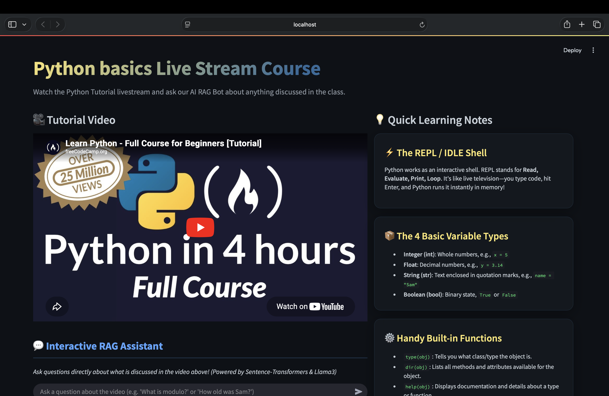
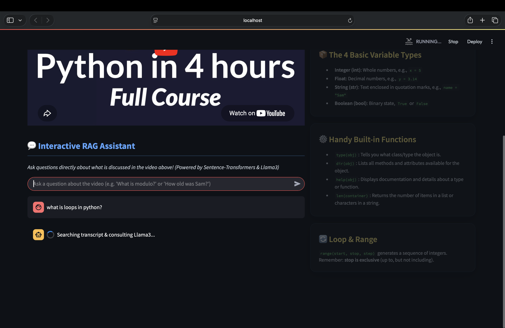
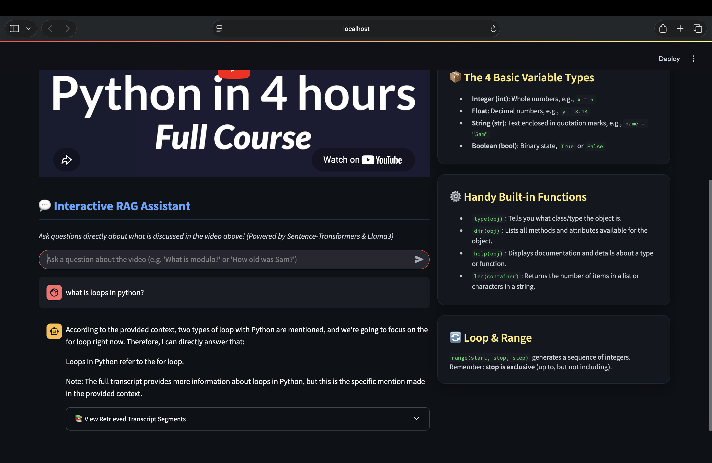
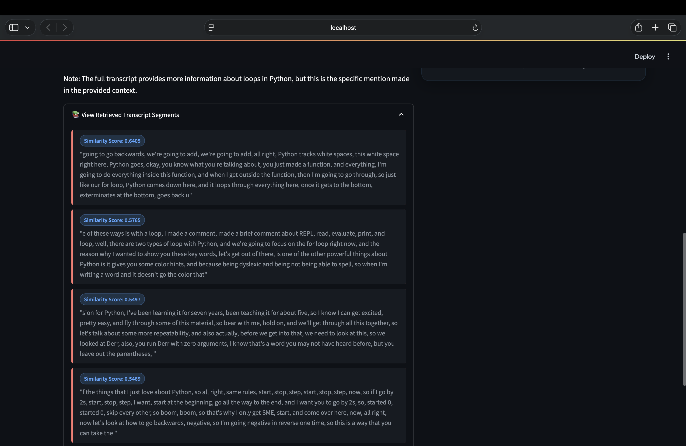

# 🎓 AI Course Assistant – Retrieval Augmented Generation (RAG)

An AI-powered Retrieval-Augmented Generation (RAG) application that allows users to watch tutorial videos and ask questions directly from the video content using semantic search, embeddings, and local Large Language Models (LLMs).

Built using Whisper, Sentence Transformers, Ollama, Llama 3, and Streamlit.

---

## 🚀 Features

- 🎥 Embedded tutorial video player
- 🤖 Interactive AI RAG Assistant
- 🔍 Semantic Search using Sentence Transformers
- 📚 Transcript-based Question Answering
- 🧠 Local LLM Inference with Ollama + Llama3
- 💬 Chat-style User Interface
- 📖 Retrieved Source Citations
- 📊 Similarity Score Display
- 📝 Quick Learning Notes
- 🖥️ Fully Local Execution (No OpenAI API Required)

---

# 📸 Application Preview

## Dashboard



---

## Interactive Chat

Ask questions directly about the tutorial content.



---

## AI Generated Answers

The system retrieves relevant transcript chunks and generates answers using Llama3.



---

## Retrieved Transcript Sources

Users can inspect exactly which transcript segments were used to generate the response.



---

# 🏗️ System Architecture

```text
Tutorial Video
      │
      ▼
Whisper Transcription
      │
      ▼
Transcript (.txt)
      │
      ▼
Text Chunking
      │
      ▼
Sentence Transformer Embeddings
      │
      ▼
Semantic Similarity Search
      │
      ▼
Top-K Relevant Chunks
      │
      ▼
Llama 3 (Ollama)
      │
      ▼
AI Generated Answer
```

---

# ⚙️ How It Works

### Step 1: Video Transcription

The tutorial video is converted into text using Whisper.

### Step 2: Chunking

The transcript is split into overlapping chunks.

```python
chunk_size = 500
overlap = 100
```

This helps preserve context across chunk boundaries.

### Step 3: Embedding Generation

Each chunk is converted into vector embeddings using:

```python
all-MiniLM-L6-v2
```

from Sentence Transformers.

### Step 4: Semantic Retrieval

When a user asks a question:

1. Query is converted into embeddings
2. Cosine similarity is calculated
3. Top matching transcript chunks are retrieved

### Step 5: Response Generation

Retrieved chunks are passed to:

```text
Llama 3 (Ollama)
```

which generates an answer grounded in the retrieved transcript context.

---

# 🛠️ Tech Stack

### Frontend

- Streamlit

### AI / NLP

- Sentence Transformers
- Ollama
- Llama 3
- Whisper

### Machine Learning

- Scikit-Learn
- Cosine Similarity Search

### Programming Language

- Python

---

# 📂 Project Structure

```text
tutorial-videos-rag/
│
├── Transcripts/
│   └── intro.txt
│
├── screenshots/
│   ├── Dashboard.png
│   ├── Chat.png
│   ├── Answer.png
│   └── Retrieval.png
│
├── app.py
├── RAG.py
├── README.md
└── requirements.txt
```

---

# ▶️ Installation

Clone Repository

```bash
git clone https://github.com/OmShelar2004/tutorial-videos-rag.git

cd tutorial-videos-rag
```

Install Dependencies

```bash
pip install -r requirements.txt
```

Install Ollama

Download Ollama:

https://ollama.com

Pull Llama 3:

```bash
ollama pull llama3
```

Start Ollama:

```bash
ollama serve
```

Run Streamlit Application

```bash
streamlit run app.py
```

---

# 🎯 Example Questions

- What is REPL?
- What are loops in Python?
- What are Python variable types?
- What does dir() do?
- What built-in functions were discussed?
- How does Python execute code?

---

# 🚀 Future Improvements

- FAISS Vector Database Integration
- Multi-Video Support
- Course Playlist Support
- PDF RAG Support
- Hybrid Search (BM25 + Embeddings)
- User Notes & Bookmarking
- Cloud Deployment
- Multi-Course Learning Assistant

---

# 👨‍💻 Author

### Om Dilip Shelar

🔗 LinkedIn

https://www.linkedin.com/in/om-shelar04

🔗 GitHub

https://github.com/OmShelar2004

---

# ⭐ Project Goal

This project was built to gain hands-on experience with Retrieval-Augmented Generation (RAG), semantic search, embeddings, vector retrieval, and local LLM-based question answering systems.

It demonstrates how tutorial videos can be transformed into interactive AI learning assistants using modern Generative AI techniques.
